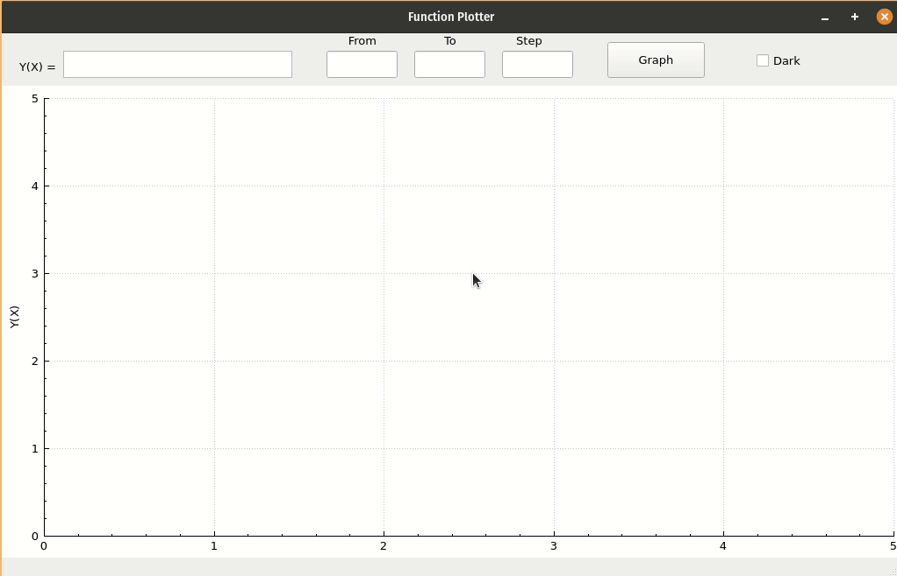

# Function Plotter
## Simple App that will plot any function you want using [Qt](https://www.qt.io/) framework and [QCustomPlot](https://www.qcustomplot.com/) library
 

_______________________________________________________________________________________________________________

### - Features 
#### Flexible, you can write your function in any format
#### if error occurr it can identify the reason 
#### Accept decimal and integer numbers in all places like the function and domain of the graph
#### Allowed characters * / + - ( )

_______________________________________________________________________________________________________________

### Examples of allowed experssions:
#### Y(X)= 5/2*X^2+3
#### Y(X)= 5/2X^2+3
#### Y(X)= 5/2(X^2)+3
#### Y(X)= 5/2*X^2+3.5
#### Y(X)= -( 5/2* X^ 2+ 3 )
__
### Most of the expressions are allowed, just make sure it is correct mathematically

----------------------------------
 

## Flow of the alghorithm
#### 1- Take the input function
#### 2- Do some regex and validations then convert it to more general format
#### 3- Convert from infix to postfix
#### 4- Evaluate the postfix expression with each possible value of x depending on the given domain
#### 5- Finally draw Y(X) and X onn the grid
